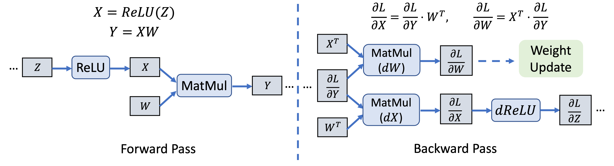
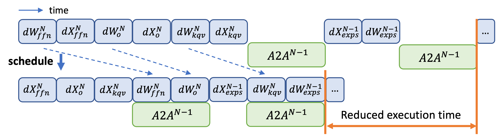
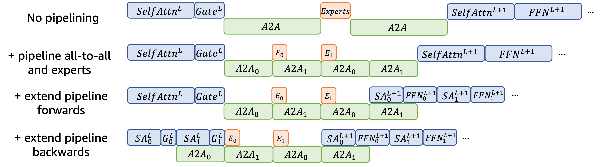

<!--- Copyright Amazon.com, Inc. or its affiliates. All Rights Reserved. -->
<!--- SPDX-License-Identifier: Apache-2.0  -->

## Accelerating MoE Training via Whole Graph Computation-Communication Overlapping

Official implementation for the paper [Lancet: Accelerating Mixture-of-Experts Training via Whole Graph Computation-Communication Overlapping](https://arxiv.org/abs/2404.19429), published in MLSys'24.

Paper Abstract:
> The Mixture-of-Expert (MoE) technique plays a crucial role in expanding the size of DNN model parameters. However, it faces the challenge of extended all-to-all communication latency during the training process. Existing methods attempt to mitigate this issue by overlapping all-to-all with expert computation. Yet, these methods frequently fall short of achieving sufficient overlap, consequently restricting the potential for performance enhancements. In our study, we extend the scope of this challenge by considering overlap at the broader training graph level. During the forward pass, we enable non-MoE computations to overlap with all-to-all through careful partitioning and pipelining. In the backward pass, we achieve overlap with all-to-all by scheduling gradient weight computations. We implement these techniques in Lancet, a system using compiler-based optimization to automatically enhance MoE model training. Our extensive evaluation reveals that Lancet significantly reduces the time devoted to non-overlapping communication, by as much as 77%. Moreover, it achieves a notable end-to-end speedup of up to 1.3 times when compared to the state-of-the-art solutions. 

### Features

This implementation is based on the [RAF](https://github.com/awslabs/raf) compiler. Main features include the following two optimizations:

**1. Scheduling weight gradient computation (dW) to overlap with all-to-all communication in the backward pass.**

Further back-propagation is only dependent on the activation gradient computation (dX) but not weight gradient computation (dW). Therefore, we have the freedom to rearrange the calculation order of dW’s and overlap them with all-to-alls.

**2. Extending partitioning and pipelining to non-MoE computations and overlap them with all-to-all communication in the forward pass.**

### Code Structure

The optimizations are mainly implemented by files in the [src/pass/dist_optimization](src/pass/dist_optimization) directory.

The entry point of the optimizations is in the [*DataParallelSchedule* pass](/src/pass/dist_optimization/data_parallel_schedule.cc#L820), inside `LancetScheduler`, where it performs two passes of the model IR as described in the paper. Please refer to the paper and the code for more details.

For the general description of the RAF compiler, please refer to the [RAF wiki](https://github.com/awslabs/raf/tree/main/docs/wiki).

### Running the Code

Please refer to the Dockerfile and the scripts in the [`docker`](/docker) directory for the dependencies and the environment setup.

Once the container is setup, you can follow the below steps:

1. Create an MPI hostfile named `hostfile` under `/models`. The number of slots for each node should match the number of GPUs available.

2. In `/models` directory, run [`create_nccl_profiles.py`](/models/create_nccl_profiles.py) to generate communication cost models.

3. Use [`run_exp_configs.py`](/models/run_exp_configs.py) to run the experiments. The experiment specifications used in the paper are in the [`experiment_configs`](/models/experiment_configs) directory.
    1. Please first run `run_exp_configs.py` with the `--lancet-profile` flag to profile the model.
    2. Then, run the same script with the `--lancet-opt` flag to generate the optimized model IR.
    3. Finally, run without these two flags to benchmark the optimized model (this step will also run the baselines, if specified in the experiment config).

*Note:* To alter the model configurations, directly change the numbers in the "name" field of the experiment config files.
* "nl": number of layers
* "m": hidden size
* "nh": number of heads
* "sl: sequence length
* "b": batch size

See [here](/models/benchmark_raf.py) and [here](/models/benchmark/pytorch/nlp.py#303) for the exact construction of the model.

## Security

**Note**: The evaluation Dockerfile automatically establishes password-less SSH connection between the containers to facilitate MPI usage. Please make sure that the code is only run in a secure environment.

See [CONTRIBUTING](CONTRIBUTING.md#security-issue-notifications) for more information.

## License

This project is licensed under the Apache-2.0 License.

